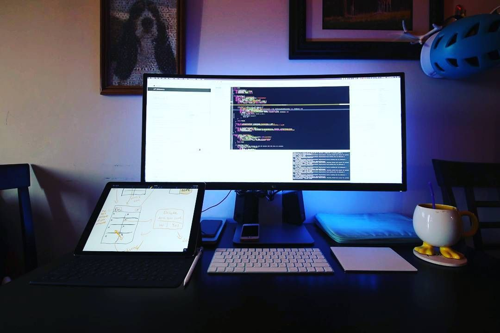

# Devio ⚡️ [](https://app.netlify.com/sites/devio/deploys)

## A minimal portfolio template for Developers!


To view a demo example, [click here](https://devio.netlify.app/)

# Getting Started

## How to Use 🔧

From your command line, first clone Devio:

```
# Clone this repository
$ git clone https://github.com/khan-rehan/DevIO.git

# Go into the repository
$ cd devio

# Remove current origin repository
$ git remote remove origin
```

# Template Instructions:

# Step 1 - STRUCTURE

Go to index.html and fill your information, they are 6 sections:

# Header section

- On `` tag, fill the `src` property with your [<dev>your-name] picture, your picture must be located inside `img/` folder.

```
<header>
   <div class = "logo">
   			
   </div>

   	<button class="nav-toggle" aria-label="toggle navigation">
   			<span class = "hamburger"></span>
   	</button>

   		<nav class="nav">
   			<ul class="nav_list">
   				<li class="nav_item"><a href="#home" class="nav_link">Home</a></li>
   				<li class="nav_item"><a href="#services" class="nav_link">My Services</a></li>
   				<li class="nav_item"><a href="#about" class="nav_link">About Me</a></li>
   				<li class="nav_item"><a href="#work" class="nav_link">My Work</a></li>
   			</ul>
   		</nav>
</header>
```

# Introduction Section

- On `section_title`, put your custom title.
- On `section_subtitle`, put your custom developer profession.
- On `` tag, fill the `src`
  property with your profile picture, your picture must be located inside `img/` folder.

```
<!--Introduction -->
    	<section class="intro" id="home">
    		<h1 class="section_title section_title--intro">
    			Hi, I am <strong> [Your Name]</strong>
    		</h1>
    		<p class="section_subtitle section_subtitle--intro">______ Developer</p>
    		
    	</section>
```

# Services Section

- On `<h3>` tag type about your custom development areas.
- On `<p>` tag include information about your developement like what you do, just describe about it.

```
<!--My services -->

    	<section class="my-services" id="services">
    		<h2 class="section_title section_title--services">What I Do</h2>
    		<div class="services">
    			<div class="service">
    				<h3>______ Development</h3>
    				<p>Lorem Ipsum is simply dummy text.</p>
    			</div> <!--service-->

    			<div class="service">
    				<h3>_______ Development</h3>
    				<p>Lorem Ipsum is simply dummy text. </p>
    			</div> <!--service-->

    		</div> <!--services-->

    		<a href="#work" class="btn">My Work</a>
    	</section>

```

# About section

- On `<p>` tag with class-name `.section_subtitle section_subtitle--about`, include information about you, I recommend to use 2 paragraphs in order to work well and a maximum of 3 paragraphs.
- On `<p>` tag, include information about you, I recommend to use 2 paragraphs in order to work well and a maximum of 3 paragraphs.
- On last `` tag, fill the src property with your display picture, your picture must be located inside `img/` folder.

```
	<!--ABout Me-->
    	<section class="about-me" id="about">
    		<h2 class="section_title section_title--about">Who I am</h2>
    		<p class="section_subtitle section_subtitle--about">____ Developer</p>
    			<div class="about-me_body">
    				<p>Lorem Ipsum is simply dummy text</p>
                    <p>Lorem Ipsum is simply dummy text </p>
                    <p>
                        <strong>
                        If you want to learn how to think then learn how to code<br>
                        -Bill Gates
                        </strong>
                    </p>
    			</div>
    		
    	</section>
```

# Project section

Go to project.html and fill your information, thers's only one sections to edit:

- In `<div>` tag with class `.portfolio`, there's a `<a>` tag with class `portfolio_item`, fill the `href` property with link to your `[Your-projectname].html` file
- In above mentioned `<a>` tag, there's a `` tag fill the src property with your main project image/logo, your picture must be located inside `img/` folder.
- Recommended size for project image (350 x 350px), your project image must live on `img/` folder.
- Each `<a>` tag represents one project, you can add as many project as you want but just do the steps mentioned above for every new project added.

```
<!-- My work-->
    	<section class="my-work" id="work">
    		<h2 class="section_title">My work</h2>
    		<p class="section_subtitle section_subtitle--work">A selection of my range of work</p>

    		<div class="portfolio">

    			<!--Portfolio item 01-->
    			<a href="project.html" class="portfolio_item">
    				
    			</a>

    			<!--Portfolio item 02-->
    			<a href="project.html" class="portfolio_item">
    				
    			</a>

    			<!--Portfolio item 03-->
    			<a href="project.html" class="portfolio_item">
    				
    			</a>

    		</div>
    	</section>
```

# Footer section

- In the first `<a>` place your own email address in `href` property after `mailto:`.
- In `<li>` with class `.social-list_item`, put your social media link on each `<a>` links in `href` property.

```
    	<!--footer-->
    	<footer class="footer">
    		<!-- replace with your own email address-->
    		<a href="mailto:xyz@gmail.com" class="footer-link">xyz@gmail.com</a>
    		<ul class="social-list">

    			<li class="social-list_item">
    				<a class="social-list_link" href="!#">
    					<i class="fab fa-instagram"></i>
    				</a>
    			</li>

    			<li class="social-list_item">
    				<a class="social-list_link" href="!#">
    					<i class="fab fa-twitter"></i>
    				</a>
    			</li>

    			<li class="social-list_item">
    				<a class="social-list_link" href="!#">
    					<i class="fab fa-linkedin"></i>
    				</a>
    			</li>

    			<li class="social-list_item">
    				<a class="social-list_link" href="!#">
    					<i class="fab fa-github"></i>
    				</a>

    			</li>

    		</ul>

    	</footer>
```

# Step 2 - Project File

- In `project.html`, the header and footer are same as `index.html` so just copy the whole thing from `index.html` and paste it into `project.html`
- On `<strong>` tag in `<h1>` tag with class name `.section_title section_title--intro` type in your project name.
- On `<p>` tag describe about your project.
- On `` tag, fill the src property with your display picture, your picture must be located inside `img/` folder.

---

- On `<p>` tag in `<div>` tag with class `.portfolio-item-individual`, Describe about your project.
- In last two `` tag, fill the src property with your projects images, your picture must be located inside `img/` folder.

---

- You can add as many projects as you want in `index.html` file, simply create a `project.html` file for that respective project with the above steps mentioned, so whenever any one clicks on any of the project in `index.html` file it should direct towards your `project.html` file

```

        <section class="intro" id="home">
            <h1 class="section_title section_title--intro">
                Title  <strong> Project name</strong>
            </h1>
            <p class="section_subtitle section_subtitle--intro">Description</p>
            
        </section>

        <div class="portfolio-item-individual">

            <p> [Describe your project here] lorem Ipsum is simply dummy text of the printing and typesetting industry.</p>
            
            
        </div>
```

# Deployment 📦

Once you have done with your setup. You need to put your website online!

I highly recommend to use [Netlify](https://www.netlify.com) to achieve this on the EASIEST WAY

Please watch step-by-step the video tutorial to successfully upload your Devio Website on Netlify!

[WATCH NOW STEP-BY-STEP TUTORIAL FOR DEPLOYMENT](https://youtu.be/tTKnuVx5qWA)

